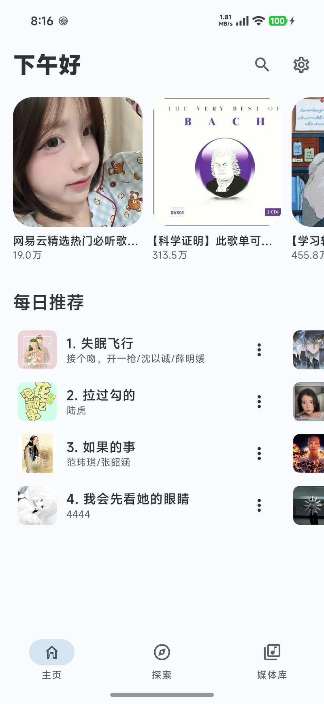
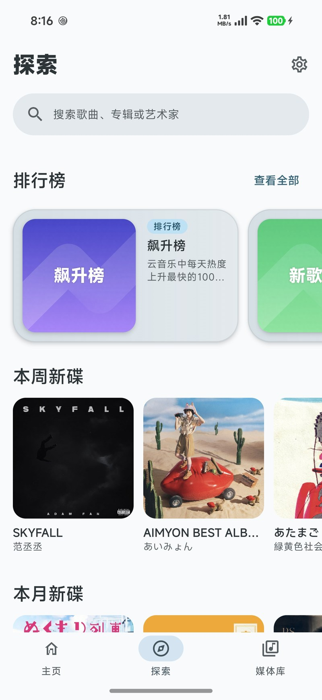
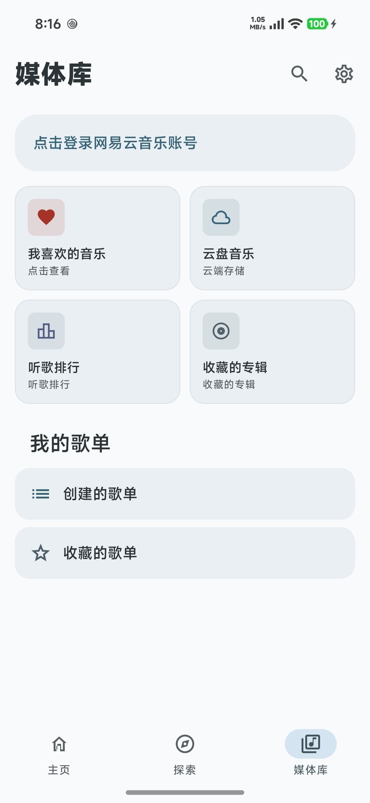
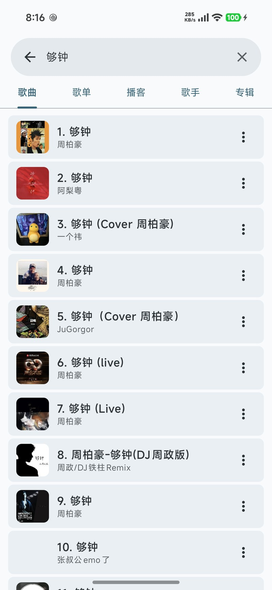
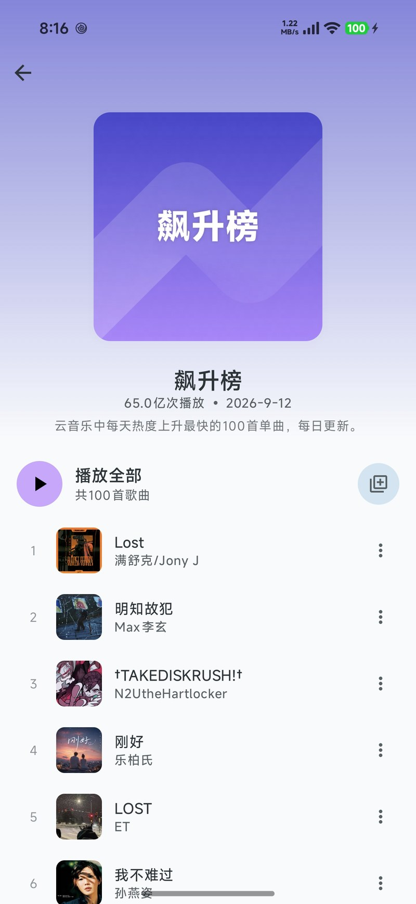
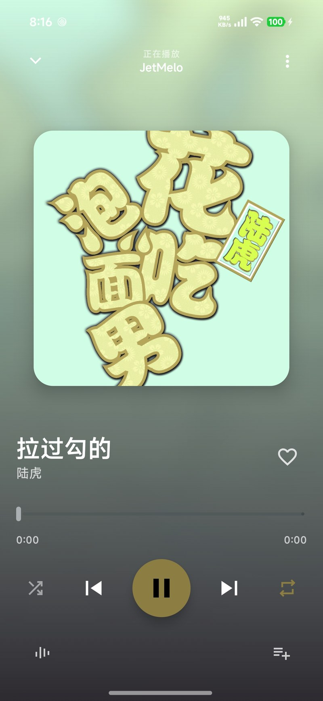
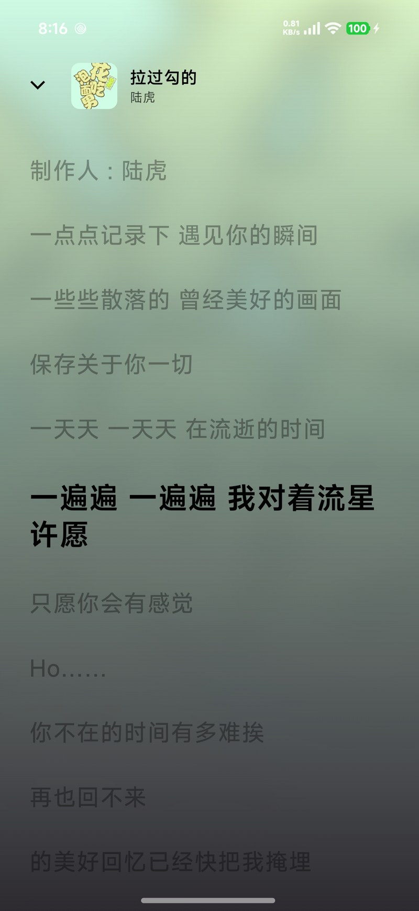
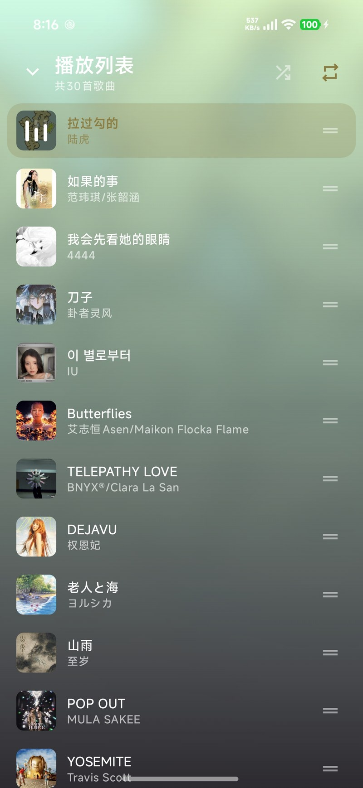

# JetMelo-Next

A Material 3 Netease Cloud Music client for Android

> **本仓库是 [rcmiku/JetMelo](https://github.com/rcmiku/JetMelo) 的修改版（fork），不是原项目的官方发布。**
>
> 自 2026 年 8 月起，由 [sense733](https://github.com/sense733) 在原项目基础上继续开发，主要改动包括：重构播放器、迷你播放栏与列表之间的转场动效，引入共享元素导航，调整歌单加载与首页数据流程，并将应用名改为 `JetMelo-Next`、包名改为 `com.jetmelo.next`（与原项目可同时安装，互不覆盖）。
>
> 原项目版权归其作者所有，本项目沿用 GPL-3.0 授权。

## Features

- Play songs from Netease Cloud Music
- Background playback
- Search songs, albums, and playlists from Cloud Netease Music
- Login support
- Synchronized lyrics
- Personalized quick picks

## Screenshot

<table>
  <tr>
    <td></td>
    <td></td>
    <td></td>
  </tr>
  <tr>
    <td></td>
    <td></td>
    <td></td>
  </tr>
  <tr>
    <td></td>
    <td></td>
    <td></td>
  </tr>
</table>

## Credit

- [JetMelo](https://github.com/rcmiku/JetMelo) —— 本项目的上游
- [InnerTune](https://github.com/z-huang/InnerTune)
- [Protobuf](https://github.com/protocolbuffers/protobuf)
- [Reorderable](https://github.com/Calvin-LL/Reorderable)
- [Ktor](https://github.com/ktorio/ktor)
- [Coil](https://github.com/coil-kt/coil)
- [Ksp](https://github.com/google/ksp)

## Disclaimer

This software is not affiliated with, funded, authorized, or endorsed by NetEase Cloud Music, Hangzhou NetEase Cloud Music Technology Co., or any of its affiliates.

This software does not provide any VIP audio decryption or unlocking services. You must obtain the appropriate membership on the respective platform to access such content.

This software is for learning and communication purposes only and should not be used for commercial purposes.

Any trademarks, service marks, trade names, or other intellectual property rights used in this software belong to their respective owners.